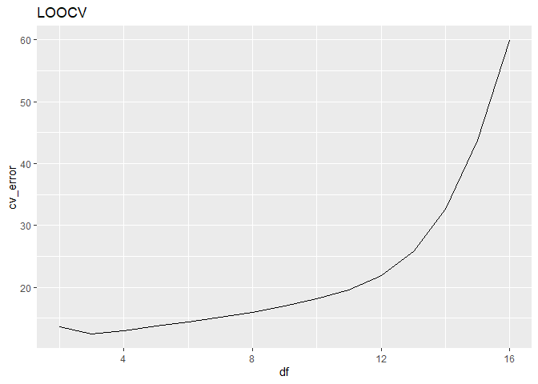
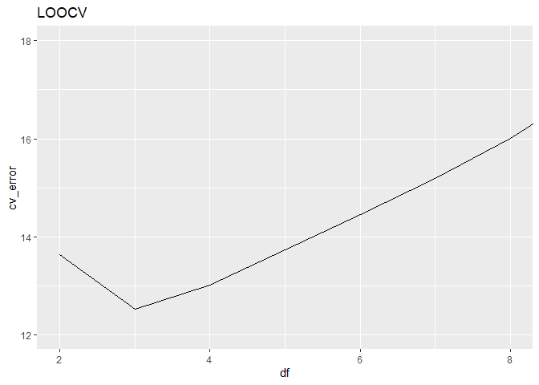

Ant data: smoothing spline model
================
Brett Melbourne
29 Jan 2024

Investigate cross-validation with the ants data and a smoothing-spline
model

``` r
library(ggplot2)
library(dplyr)
source("source/random_partitions.R") #Function is now in our custom library
```

Forest ant data:

``` r
forest_ants <- read.csv("data/ants.csv") |> 
    filter(habitat=="forest")
```

Example of a smoothing spline model. Try running this next block of code
to visualize the model predictions for different values of `df`. Here is
df=7.

``` r
smooth_trained <- smooth.spline(forest_ants$latitude, forest_ants$richness, df=7)
grid_latitude  <- seq(min(forest_ants$latitude), max(forest_ants$latitude), length.out=201)
preds <- data.frame(predict(smooth_trained, x=grid_latitude))
forest_ants |> 
    ggplot() +
    geom_point(aes(x=latitude, y=richness)) +
    geom_line(data=preds, aes(x=x, y=y)) +
    coord_cartesian(ylim=c(0,20))
```

<!-- -->

Using `predict` to ask for predictions from the fitted smoothing spline
model.

``` r
predict(smooth_trained, x=43.2)
```

    ## $x
    ## [1] 43.2
    ## 
    ## $y
    ## [1] 6.153927

``` r
predict(smooth_trained, x=forest_ants$latitude)
```

    ## $x
    ##  [1] 41.97 42.00 42.03 42.05 42.05 42.17 42.19 42.23 42.27 42.31 42.56 42.57
    ## [13] 42.58 42.69 43.33 44.06 44.29 44.33 44.50 44.55 44.76 44.95
    ## 
    ## $y
    ##  [1] 12.817055 12.912472 12.958514 12.947059 12.947059 12.286418 12.109456
    ##  [8] 11.736305 11.328454 10.880076  7.816294  7.688693  7.561640  6.342989
    ## [15]  6.643114  6.319358  5.750168  5.793960  6.298994  6.426903  6.377938
    ## [22]  6.057080

``` r
predict(smooth_trained, x=seq(41, 45, by=0.5))
```

    ## $x
    ## [1] 41.0 41.5 42.0 42.5 43.0 43.5 44.0 44.5 45.0
    ## 
    ## $y
    ## [1]  9.444714 11.183034 12.912472  8.577191  5.497952  7.031636  6.517861
    ## [8]  6.298994  5.967671

LOOCV (since it’s a small dataset) LOOCV is deterministic for this
model.

In writing this function (largely copy and paste from the previous
example), compared to the previous example, I have also removed
dependencies on external libraries by replacing the `filter()` function
from `dplyr` with the base R function `subset()`. Reducing dependencies
in reusable components of code is good programming practice.

``` r
# Function to perform k-fold CV for a smoothing spline on ants data
# forest_ants: forest ants dataset (dataframe)
# k:           number of partitions (scalar, integer)
# df:          degrees of freedom in smoothing spline (scalar, integer)
# return:      CV error as MSE (scalar, numeric)
#
cv_smooth_ants <- function(forest_ants, k, df) {
    forest_ants$partition <- random_partitions(nrow(forest_ants), k)
    e <- rep(NA, k)
    for ( i in 1:k ) {
        test_data <- subset(forest_ants, partition == i)
        train_data <- subset(forest_ants, partition != i)
        smooth_trained <- smooth.spline(train_data$latitude, train_data$richness, df=df)
        pred_richness <- predict(smooth_trained, test_data$latitude)$y
        e[i] <- mean((test_data$richness - pred_richness) ^ 2)
    }
    cv_error <- mean(e)
    return(cv_error)
}
```

Test/use the function (in LOOCV mode)

``` r
nrow(forest_ants) #22 data points
```

    ## [1] 22

``` r
cv_smooth_ants(forest_ants, k=22, df=7)
```

    ## [1] 15.18528

Explore a grid of values for df (k is always 22 for LOOCV)

``` r
grid <- expand.grid(k=nrow(forest_ants), df=2:16)
grid
```

    ##     k df
    ## 1  22  2
    ## 2  22  3
    ## 3  22  4
    ## 4  22  5
    ## 5  22  6
    ## 6  22  7
    ## 7  22  8
    ## 8  22  9
    ## 9  22 10
    ## 10 22 11
    ## 11 22 12
    ## 12 22 13
    ## 13 22 14
    ## 14 22 15
    ## 15 22 16

``` r
cv_error <- rep(NA, nrow(grid))
for ( i in 1:nrow(grid) ) {
    cv_error[i] <- cv_smooth_ants(forest_ants, grid$k[i], grid$df[i])
}
result <- cbind(grid, cv_error)
```

Plot the result.

``` r
result |>
    ggplot() +
    geom_line(aes(x=df, y=cv_error)) +
    labs(title="LOOCV")
```

<!-- -->

We see that MSE prediction error (cv_error) increases dramatically for
df beyond 8 or so.

``` r
result |> 
    ggplot() +
    geom_line(aes(x=df, y=cv_error)) +
    coord_cartesian(xlim=c(2,8), ylim=c(12,18)) +
    labs(title="LOOCV")
```

<!-- -->

Table of results

``` r
result
```

    ##     k df cv_error
    ## 1  22  2 13.63027
    ## 2  22  3 12.52225
    ## 3  22  4 13.00204
    ## 4  22  5 13.73207
    ## 5  22  6 14.45487
    ## 6  22  7 15.18528
    ## 7  22  8 16.01141
    ## 8  22  9 16.99104
    ## 9  22 10 18.14464
    ## 10 22 11 19.61896
    ## 11 22 12 21.89656
    ## 12 22 13 25.81233
    ## 13 22 14 32.63790
    ## 14 22 15 43.72262
    ## 15 22 16 59.87569

LOOCV (k=22) identifies df=3 as the best performing model. Compared to
the polynomial we had from before, this model has slightly better
prediction accuracy.

| Model              | LOOCV |
|--------------------|-------|
| Polynomial 2       | 12.88 |
| Smoothing spline 3 | 12.52 |
