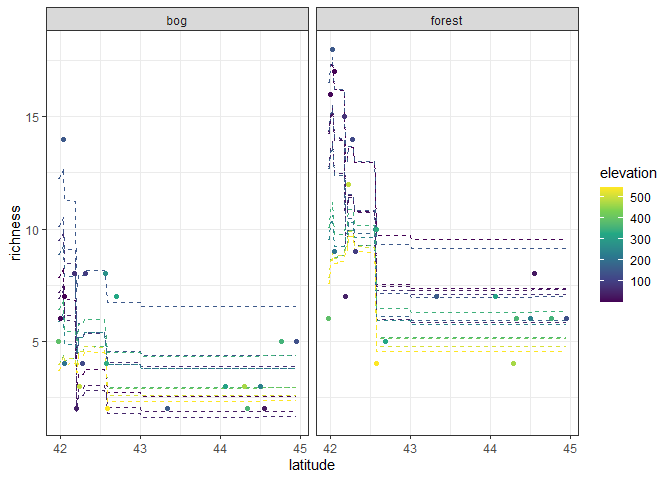

Ant data: xgboost
================
Brett Melbourne
20 Feb 2024

xgboost illustrated with the ants data.

``` r
library(ggplot2)
library(dplyr)
#library(tree)
library(xgboost)
```

xgboost is a very fast implementation of boosted regression trees with
several innovations on top of basic gradient boosting. It natively
supports parallel CPU and GPU training. It is widely regarded as the
current state of the art.

Ant data with 3 predictors of species richness. xgboost takes only
numeric data, so we need to encode habitat with a dummy variable, which
will be the new column “forest”.

``` r
ants <- read.csv("data/ants.csv") |> 
    mutate(forest=ifelse(habitat == "forest", 1, 0)) |>
    select(richness, latitude, elevation, forest, habitat)
ants
```

    ##    richness latitude elevation forest habitat
    ## 1         6    41.97       389      1  forest
    ## 2        16    42.00         8      1  forest
    ## 3        18    42.03       152      1  forest
    ## 4        17    42.05         1      1  forest
    ## 5         9    42.05       210      1  forest
    ## 6        15    42.17        78      1  forest
    ## 7         7    42.19        47      1  forest
    ## 8        12    42.23       491      1  forest
    ## 9        14    42.27       121      1  forest
    ## 10        9    42.31        95      1  forest
    ## 11       10    42.56       274      1  forest
    ## 12       10    42.57       335      1  forest
    ## 13        4    42.58       543      1  forest
    ## 14        5    42.69       323      1  forest
    ## 15        7    43.33       158      1  forest
    ## 16        7    44.06       313      1  forest
    ## 17        4    44.29       468      1  forest
    ## 18        6    44.33       362      1  forest
    ## 19        6    44.50       236      1  forest
    ## 20        8    44.55        30      1  forest
    ## 21        6    44.76       353      1  forest
    ## 22        6    44.95       133      1  forest
    ## 23        5    41.97       389      0     bog
    ## 24        6    42.00         8      0     bog
    ## 25       14    42.03       152      0     bog
    ## 26        7    42.05         1      0     bog
    ## 27        4    42.05       210      0     bog
    ## 28        8    42.17        78      0     bog
    ## 29        2    42.19        47      0     bog
    ## 30        3    42.23       491      0     bog
    ## 31        4    42.27       121      0     bog
    ## 32        8    42.31        95      0     bog
    ## 33        8    42.56       274      0     bog
    ## 34        4    42.57       335      0     bog
    ## 35        2    42.58       543      0     bog
    ## 36        7    42.69       323      0     bog
    ## 37        2    43.33       158      0     bog
    ## 38        3    44.06       313      0     bog
    ## 39        3    44.29       468      0     bog
    ## 40        2    44.33       362      0     bog
    ## 41        3    44.50       236      0     bog
    ## 42        2    44.55        30      0     bog
    ## 43        5    44.76       353      0     bog
    ## 44        5    44.95       133      0     bog

We need an xgboost matrix as the data structure to pass to xgboost. This
specifies the predictor variables and the response variable.

``` r
dtrain <- xgb.DMatrix(data=as.matrix(ants[,2:4]), label=ants$richness)
class(dtrain)
```

    ## [1] "xgb.DMatrix"

``` r
colnames(dtrain)
```

    ## [1] "latitude"  "elevation" "forest"

Train the model (eta is the learning rate)

``` r
bstDMatrix <- xgboost(data=dtrain, max_depth=2, eta=0.01, nthread=2, 
                      nrounds=1000, objective="reg:squarederror")
```

Predictions from the model

``` r
grid_data  <- expand.grid(
    latitude=seq(min(ants$latitude), max(ants$latitude), length.out=201),
    elevation=seq(min(ants$elevation), max(ants$elevation), length.out=51),
    forest=0:1)
boost_preds <- predict(bstDMatrix, newdata=as.matrix(grid_data))
```

Plot. This is a very expressive model.

``` r
grid_data$habitat <- ifelse(grid_data$forest == 1, "forest", "bog")
preds <- cbind(grid_data, richness=boost_preds)
ants |>
    ggplot() +
    geom_line(data=preds, 
              aes(x=latitude, y=richness, col=elevation, group=factor(elevation)),
              linetype=2) +
    geom_point(aes(x=latitude, y=richness, col=elevation)) +
    facet_wrap(vars(habitat)) +
    scale_color_viridis_c() +
    theme_bw()
```

<!-- -->
