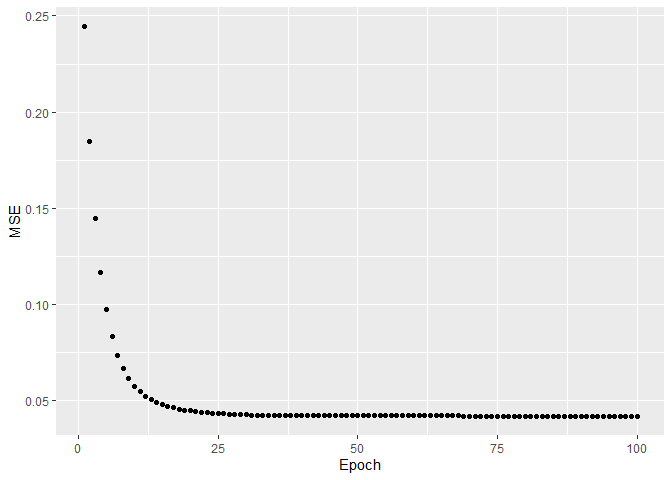

Mini-batch stochastic gradient descent training algorithm
================
Brett Melbourne
27 Feb 2025

Mini-batch stochastic gradient descent is the basic algorithm most
widely used to train neural networks. I illustrate it here to train a
simple linear model. The code here is substantially the same as the
previous stochastic gradient descent code. The innovation is randomly
partitioning the data into small batches and iterating through the
batches.

``` r
library(ggplot2)
source("source/random_partitions.R")
```

Generate data for a linear model with one x variable.

``` r
set.seed(7362)
b_0 <- 0
b_1 <- 1
n <- 100 #number of data points
x <- runif(n, -1, 1)
y <- rnorm(length(x), mean=b_0 + b_1 * x, sd=0.25)
ggplot(data.frame(x, y)) +
    geom_point(aes(x, y))
```

<!-- -->

Mini batch stochastic Gradient descent algorithm:

    set lambda
    set number of epochs
    set batch size
    make initial guess for b_0, b_1
    for each epoch
        randomly partition data into batches               <- the innovation
        for each batch
            find gradient at b_0, b_1
            step down: b = b - lambda * gradient(b)
    print b_0, b_1

Code this algorithm in R

``` r
lambda <- 0.01
n_epochs <- 100
batch_size <- 10
b_0 <- -0.5
b_1 <- 1.4
for ( epoch in 1:n_epochs ) {
    
    # randomly partition data into batches                 <- the innovation
    batch <- random_partitions(n, trunc(n / batch_size))
    
    for ( b in 1:max(batch) ) {
        
        # get batch rows
        row_i <- which(batch == b)
        nr <- length(row_i)
        
        # find gradient at b_0, b_1
        y_pred <- b_0 + b_1 * x[row_i]
        r <- y[row_i] - y_pred
        db_1 <- -2 * sum(r * x[row_i]) / nr
        db_0 <- -2 * sum(r) / nr
        
        # step down
        b_0 <- b_0 - lambda * db_0
        b_1 <- b_1 - lambda * db_1
    }
    
}
b_0
```

    ## [1] -0.003376139

``` r
b_1
```

    ## [1] 1.044286

Compare to standard least squares solution (QR decomposition)

``` r
lm(y ~ x)
```

    ## 
    ## Call:
    ## lm(formula = y ~ x)
    ## 
    ## Coefficients:
    ## (Intercept)            x  
    ##   -0.003106     1.043972

It’s useful to track and plot progress in descending the loss function
(most neural network training algorithms will include this). After each
epoch, calculate the loss on the whole dataset. Add this to the above
algorithm:

``` r
lambda <- 0.01
n_epochs <- 100
batch_size <- 10
b_0 <- -0.5
b_1 <- 1.4
MSE <- rep(NA, n_epochs)
for ( epoch in 1:n_epochs ) {
    
    # randomly partition data into batches                 <- the innovation
    batch <- random_partitions(n, trunc(n / batch_size))
    
    for ( b in 1:max(batch) ) {
        
        # get batch rows
        row_i <- which(batch == b)
        nr <- length(row_i)
        
        # find gradient at b_0, b_1
        y_pred <- b_0 + b_1 * x[row_i]
        r <- y[row_i] - y_pred
        db_1 <- -2 * sum(r * x[row_i]) / nr
        db_0 <- -2 * sum(r) / nr
        
        # step down
        b_0 <- b_0 - lambda * db_0
        b_1 <- b_1 - lambda * db_1
    }
    
    # Track loss function progress
    y_pred <- b_0 + b_1 * x
    r <- y - y_pred
    MSE[epoch] <- mean(r^2)
    
}

# Plot progress in descending the loss function

data.frame(Epoch=1:n_epochs, MSE) |>
    ggplot(aes(Epoch, MSE)) +
    geom_point()
```

<!-- -->

Animate the algorithm (run this code)

``` r
grid <- expand.grid(b_0 = seq(-1, 1, 0.05), b_1 = seq(0, 2, 0.05))
mse <- rep(NA, nrow(grid))
for ( i in 1:nrow(grid) ) {
    y_pred <- grid$b_0[i] + grid$b_1[i] * x
    mse[i] <- sum((y - y_pred) ^ 2) / n
}
mse_grid <- cbind(grid, mse)

b_0_vals <- unique(mse_grid$b_0)
mse_b_0 <- rep(NA, length(b_0_vals))
for ( i in 1:length(b_0_vals) ) {
    mse_b_0[i] <- min(mse_grid[mse_grid$b_0 == b_0_vals[i],"mse"])
}

b_1_vals <- unique(mse_grid$b_1)
mse_b_1 <- rep(NA, length(b_1_vals))
for ( i in 1:length(b_1_vals) ) {
    mse_b_1[i] <- min(mse_grid[mse_grid$b_1 == b_1_vals[i],"mse"])
}


# Pause for the specified number of seconds.
pause <- function( secs ) {
    start_time <- proc.time()
    while ( (proc.time() - start_time)["elapsed"] < secs ) {
        #Do nothing
    }
}

# Function to make gradient plots
make_plots <- function() {
    grid_b_0 <- seq(-1, 1, 0.05)
    mse <- rep(NA, length(grid_b_0))
    for ( i in 1:length(grid_b_0) ) {
        y_pred <- grid_b_0[i] + b_1 * x[row_i]
        mse[i] <- sum((y[row_i] - y_pred) ^ 2) / length(row_i)
    }
    plot(b_0_vals, mse_b_0, type="l", ylim=c(0, 0.4),
         main=paste("Epoch", epoch, "Batch", b))
    lines(grid_b_0, mse, col="blue")
    y_pred <- b_0 + b_1 * x[row_i]
    mse <- sum((y[row_i] - y_pred) ^ 2) / length(row_i)
    points(b_0, mse, col="red", pch=19)
    abline(mse - db_0 * b_0, db_0, col="red")
    
    grid_b_1 <- seq(0, 2, 0.05)
    mse <- rep(NA, length(grid_b_1))
    for ( i in 1:length(grid_b_1) ) {
        y_pred <- b_0 + grid_b_1[i] * x[row_i]
        mse[i] <- sum((y[row_i] - y_pred) ^ 2) / length(row_i)
    }
    plot(b_1_vals, mse_b_1, type="l", ylim=c(0, 0.4))
    lines(grid_b_1, mse, col="blue")
    y_pred <- b_0 + b_1 * x[row_i]
    mse <- sum((y[row_i] - y_pred) ^ 2) / length(row_i)
    points(b_1, mse, col="red", pch=19)
    abline(mse - db_1 * b_1, db_1, col="red")
}

# Gradient descent algorithm with gradient plots
par(mfrow=c(1,2))

lambda <- 0.01
n_epochs <- 100
batch_size <- 10
b_0 <- -0.5
b_1 <- 1.4
for ( epoch in 1:n_epochs ) {
    
    # randomly partition data into batches                 <- the innovation
    batch <- random_partitions(n, trunc(n / batch_size))
    
    for ( b in 1:max(batch) ) {
        
        # get batch rows
        row_i <- which(batch == b)
        nr <- length(row_i)
        
        # find gradient at b_0, b_1
        y_pred <- b_0 + b_1 * x[row_i]
        r <- y[row_i] - y_pred
        db_1 <- -2 * sum(r * x[row_i]) / nr
        db_0 <- -2 * sum(r) / nr
        
        # Make plots
        if ( epoch <= 4 | ( b == max(unique(batch)) & epoch %% 5 == 0 ) ) {
            make_plots()
            pause(1)
        }

        # step down
        b_0 <- b_0 - lambda * db_0
        b_1 <- b_1 - lambda * db_1
    }
    
}
```
