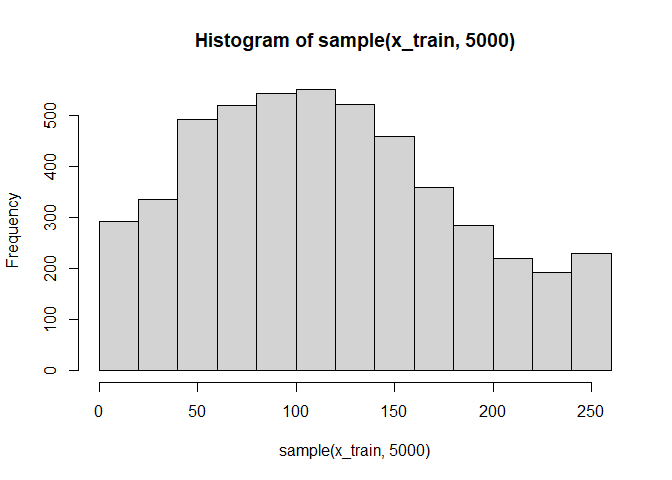
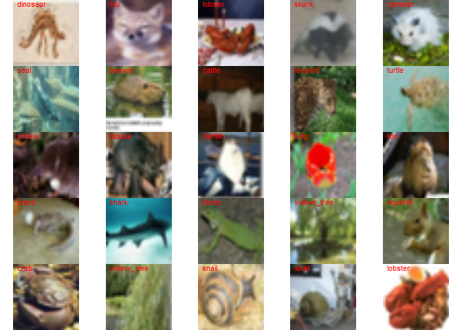
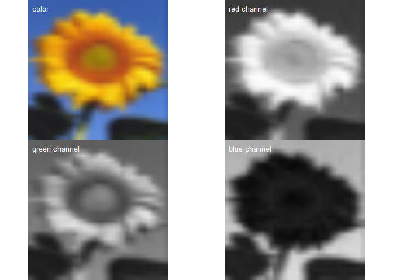
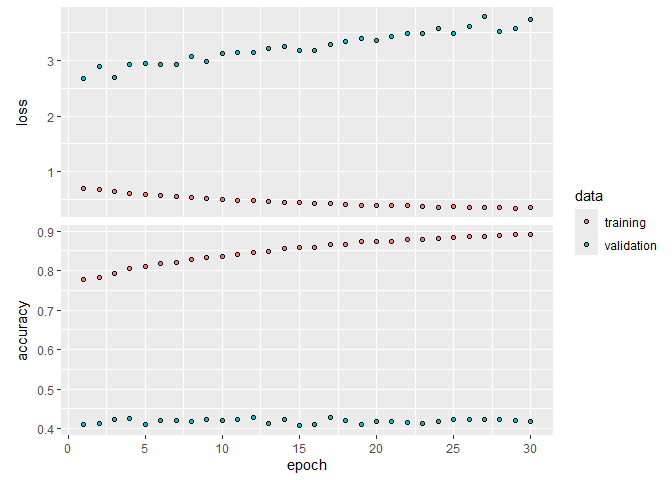
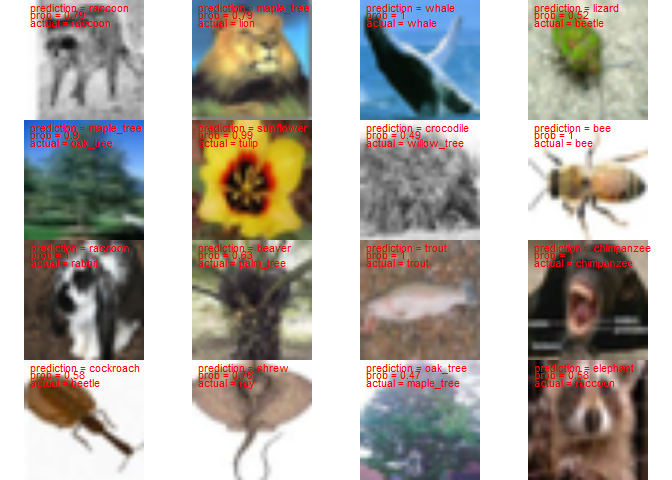
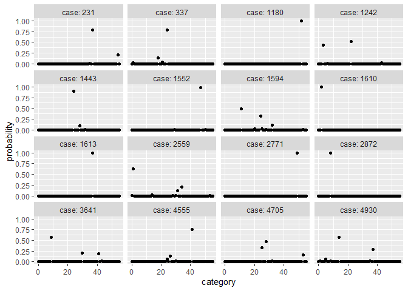

Convolutional neural network
================
Brett Melbourne
04 Mar 2024

To demonstrate a CNN, we are using a standard benchmark dataset,
CIFAR100 but subsetted to images in ecological categories. These are
small images, so training is not too computationally demanding.

``` r
reticulate::use_condaenv(condaenv = "r-tensorflow")
library(ggplot2)
library(dplyr)
library(keras)
source("source/prep_cifar56eco.R")
tensorflow::set_random_seed(2726) #sets for tensorflow, keras, and R
```

Load the data (image set with labels). I have written a function to
extract the ecological images from the CIFAR100 benchmark image dataset
packaged with keras. The first time you run this, the data will download
to your computer into a folder in the working directory called
`data_large`. The folder will be created if it doesn’t exist. The folder
will be added to your `.gitignore` file so the large file is not
uploaded to GitHub. The file is 150MB.

``` r
if ( !file.exists("data_large/cifar56eco.RData") ) {
    prep_cifar56eco()
}
load("data_large/cifar56eco.RData")
```

This has loaded 5 objects: `x_train`, `x_test`, `y_train`, `y_test`,
`eco_labels`. Let’s inspect these objects.

For `x_train` we have 28000 images, each 32 x 32 pixels in 3 channels
(RGB), arranged in a 4D array. Pixel values range from 0-255.

``` r
dim(x_train)
```

    ## [1] 28000    32    32     3

``` r
class(x_train)
```

    ## [1] "array"

``` r
range(x_train)
```

    ## [1]   0 255

``` r
hist(sample(x_train, 5000))
```

<!-- -->

For `x_test`, we have 5600 images.

``` r
dim(x_test)
```

    ## [1] 5600   32   32    3

For y we have integers coding for 56 categories arranged in a 2D array
(1 column matrix). Integers range from 0 to 55. Indexing starts at zero
in Python and tensorflow.

``` r
dim(y_train)
```

    ## [1] 28000     1

``` r
class(y_train)
```

    ## [1] "matrix" "array"

``` r
head(y_train)
```

    ##      [,1]
    ## [1,]    7
    ## [2,]   12
    ## [3,]   14
    ## [4,]   53
    ## [5,]   47
    ## [6,]   54

``` r
sort(unique(y_train)) #56 ecological categories
```

    ##  [1]  0  1  2  3  4  5  6  7  8  9 10 11 12 13 14 15 16 17 18 19 20 21 22 23 24
    ## [26] 25 26 27 28 29 30 31 32 33 34 35 36 37 38 39 40 41 42 43 44 45 46 47 48 49
    ## [51] 50 51 52 53 54 55

For `eco_labels` we have a dataframe containing the category names
associated with the integer class codes

``` r
eco_labels
```

    ##    class        name
    ## 1      0        bear
    ## 2      1      beaver
    ## 3      2         bee
    ## 4      3      beetle
    ## 5      4   butterfly
    ## 6      5       camel
    ## 7      6 caterpillar
    ## 8      7      cattle
    ## 9      8  chimpanzee
    ## 10     9   cockroach
    ## 11    10        crab
    ## 12    11   crocodile
    ## 13    12    dinosaur
    ## 14    13     dolphin
    ## 15    14    elephant
    ## 16    15    flatfish
    ## 17    16      forest
    ## 18    17         fox
    ## 19    18     hamster
    ## 20    19    kangaroo
    ## 21    20     leopard
    ## 22    21        lion
    ## 23    22      lizard
    ## 24    23     lobster
    ## 25    24  maple_tree
    ## 26    25    mountain
    ## 27    26       mouse
    ## 28    27    mushroom
    ## 29    28    oak_tree
    ## 30    29      orchid
    ## 31    30       otter
    ## 32    31   palm_tree
    ## 33    32   pine_tree
    ## 34    33       poppy
    ## 35    34   porcupine
    ## 36    35      possum
    ## 37    36      rabbit
    ## 38    37     raccoon
    ## 39    38         ray
    ## 40    39        seal
    ## 41    40       shark
    ## 42    41       shrew
    ## 43    42       skunk
    ## 44    43       snail
    ## 45    44       snake
    ## 46    45      spider
    ## 47    46    squirrel
    ## 48    47   sunflower
    ## 49    48       tiger
    ## 50    49       trout
    ## 51    50       tulip
    ## 52    51      turtle
    ## 53    52       whale
    ## 54    53 willow_tree
    ## 55    54        wolf
    ## 56    55        worm

Data preparation 1: convert image data to 0-1 scale.

``` r
x_train <- x_train / 255
x_test <- x_test / 255
```

Data preparation 2: convert integer response to a dummy variable matrix
suitable for keras/tensorflow. We’ll use the `to_categorical()` function
from `keras` to do that.

``` r
y_train_int <- y_train #keep a copy of the integer version for labelling later
y_train <- to_categorical(y_train, 56)
```

The result is a matrix with 56 columns, 1 column for each category of
organism.

``` r
class(y_train)
```

    ## [1] "matrix" "array"

``` r
dim(y_train)
```

    ## [1] 28000    56

Looking at some portions of the matrix (upper left 6x14; row 1) we see
we have rows of zeros and ones, with a 1 in the column that represents
the category of the organism in the image.

``` r
y_train[1:6,1:14] 
```

    ##      [,1] [,2] [,3] [,4] [,5] [,6] [,7] [,8] [,9] [,10] [,11] [,12] [,13] [,14]
    ## [1,]    0    0    0    0    0    0    0    1    0     0     0     0     0     0
    ## [2,]    0    0    0    0    0    0    0    0    0     0     0     0     1     0
    ## [3,]    0    0    0    0    0    0    0    0    0     0     0     0     0     0
    ## [4,]    0    0    0    0    0    0    0    0    0     0     0     0     0     0
    ## [5,]    0    0    0    0    0    0    0    0    0     0     0     0     0     0
    ## [6,]    0    0    0    0    0    0    0    0    0     0     0     0     0     0

``` r
y_train[1,] 
```

    ##  [1] 0 0 0 0 0 0 0 1 0 0 0 0 0 0 0 0 0 0 0 0 0 0 0 0 0 0 0 0 0 0 0 0 0 0 0 0 0 0
    ## [39] 0 0 0 0 0 0 0 0 0 0 0 0 0 0 0 0 0 0

There are 500 images in each category, so this a balanced training set.

``` r
colSums(y_train)
```

    ##  [1] 500 500 500 500 500 500 500 500 500 500 500 500 500 500 500 500 500 500 500
    ## [20] 500 500 500 500 500 500 500 500 500 500 500 500 500 500 500 500 500 500 500
    ## [39] 500 500 500 500 500 500 500 500 500 500 500 500 500 500 500 500 500 500

Here’s a random selection of images. You can see the image quality is
poor and it’s hard even for a human to identify many of these organisms
even with the label written on the image!

``` r
par(mar=c(0,0,0,0), mfrow=c(5,5))
for (i in sample(1:dim(x_train)[1], 25) ) {
    plot(as.raster(x_train[i,,,]))
    text(0, 30, labels=eco_labels$name[y_train_int[i,]+1], col="red", pos=4)
}
```

<!-- -->

Each image has 3 channels: RGB. In these plots the level of each channel
is displayed in grayscale (bright indicates a higher level).

``` r
par(mar=c(0,0,0,0), mfrow=c(2,2))
plot(as.raster(x_train[175,,,]))
text(0, 30, "color", col="white", pos=4)
plot(as.raster(x_train[175,,,1]))
text(0, 30, "red channel", col="white", pos=4)
plot(as.raster(x_train[175,,,2]))
text(0, 30, "green channel", col="white", pos=4)
plot(as.raster(x_train[175,,,3]))
text(0, 30, "blue channel", col="white", pos=4)
```

<!-- -->

Now we’ll set up the model. Define the CNN architecture. The input layer
is a 32 x 32 x 3 array. The output layer is the probability in each of
the 56 categories.

``` r
modcnn1 <- keras_model_sequential(input_shape=c(32,32,3)) |>
#   1st convolution-pool layer sequence
    layer_conv_2d(filters=32, kernel_size=c(3,3), padding="same") |>
    layer_activation_relu() |> 
    layer_max_pooling_2d(pool_size=c(2,2)) |>
#   2nd convolution-pool layer sequence    
    layer_conv_2d(filters=64, kernel_size=c(3,3), padding="same") |> 
    layer_activation_relu() |> 
    layer_max_pooling_2d(pool_size=c(2,2)) |>
#   3rd convolution-pool layer sequence    
    layer_conv_2d(filters=128, kernel_size=c(3,3), padding="same") |> 
    layer_activation_relu() |> 
    layer_max_pooling_2d(pool_size=c(2,2)) |>
#   4th convolution-pool layer sequence
    layer_conv_2d(filters=256, kernel_size=c(3,3), padding="same") |> 
    layer_activation_relu() |> 
    layer_max_pooling_2d(pool_size=c(2,2)) |>
#   Flatten with dropout regularization
    layer_flatten() |>
    layer_dropout(rate=0.5) |>
#   Standard dense layer
    layer_dense(units=512) |>
    layer_activation_relu() |>
#   Output layer with softmax (56 categories to predict)    
    layer_dense(units=56) |> 
    layer_activation_softmax()
```

Check the architecture

``` r
modcnn1
```

    ## Model: "sequential"
    ## ________________________________________________________________________________
    ##  Layer (type)                       Output Shape                    Param #     
    ## ================================================================================
    ##  conv2d_3 (Conv2D)                  (None, 32, 32, 32)              896         
    ##  re_lu_4 (ReLU)                     (None, 32, 32, 32)              0           
    ##  max_pooling2d_3 (MaxPooling2D)     (None, 16, 16, 32)              0           
    ##  conv2d_2 (Conv2D)                  (None, 16, 16, 64)              18496       
    ##  re_lu_3 (ReLU)                     (None, 16, 16, 64)              0           
    ##  max_pooling2d_2 (MaxPooling2D)     (None, 8, 8, 64)                0           
    ##  conv2d_1 (Conv2D)                  (None, 8, 8, 128)               73856       
    ##  re_lu_2 (ReLU)                     (None, 8, 8, 128)               0           
    ##  max_pooling2d_1 (MaxPooling2D)     (None, 4, 4, 128)               0           
    ##  conv2d (Conv2D)                    (None, 4, 4, 256)               295168      
    ##  re_lu_1 (ReLU)                     (None, 4, 4, 256)               0           
    ##  max_pooling2d (MaxPooling2D)       (None, 2, 2, 256)               0           
    ##  flatten (Flatten)                  (None, 1024)                    0           
    ##  dropout (Dropout)                  (None, 1024)                    0           
    ##  dense_1 (Dense)                    (None, 512)                     524800      
    ##  re_lu (ReLU)                       (None, 512)                     0           
    ##  dense (Dense)                      (None, 56)                      28728       
    ##  softmax (Softmax)                  (None, 56)                      0           
    ## ================================================================================
    ## Total params: 941944 (3.59 MB)
    ## Trainable params: 941944 (3.59 MB)
    ## Non-trainable params: 0 (0.00 Byte)
    ## ________________________________________________________________________________

We see that the model has almost 1 million parameters! For example, in
the first convolutional layer we have 32 filters, each 3x3, for each of
the 3 input channels (RGB), so 32 x 3 x 3 x 3 = 864 weights to which we
add 32 bias parameters (one for each output channel) to give 896
parameters. In the second convolutional layer we have 64 x 3 x 3 x 32 +
64 = 18496, and so on. At the input to the dense feedforward network
where the array is flattened we have 1024 nodes connected to 512 nodes,
so 1024 x 512 weights + 512 biases = 524800 parameters. Nevertheless, we
do have a lot of data, about 86 million pixels (28000 x 32 x 32 x 3).

Compile the model, specifying a `categorical_crossentropy` loss
function, which will be used in the gradient descent algorithm. This is
a measure of fit and accuracy on a likelihood scale. `RMSprop` is the
default training algorithm, a variant of stochastic gradient descent
that incorporates an adaptive learning rate for each parameter (i.e. for
each of the many weights and biases). We’ll also collect a second and
more direct measure of accuracy.

``` r
compile(modcnn1, loss="categorical_crossentropy", optimizer="rmsprop",
        metrics="accuracy")
```

Train the model using an 80/20 train/validate split to monitor progress.
This will take about 15 minutes on CPU or about 20 seconds on a single
NVidia A100 GPU (e.g. on a CU Alpine compute node).

``` r
fit(modcnn1, x_train, y_train, epochs=30, batch_size=128, 
    validation_split=0.2) -> history
```

Save the model or load previously trained model. The first time you save
the model you’ll need to set up the directories before running the
following code.

``` r
# save_model_tf(modcnn1, "08_4_convolutional_nnet_files/saved/modcnn1")
# save(history, file="08_4_convolutional_nnet_files/saved/modcnn1_history.Rdata")
modcnn1 <- load_model_tf("08_4_convolutional_nnet_files/saved/modcnn1")
load("08_4_convolutional_nnet_files/saved/modcnn1_history.Rdata")
```

Plotting the training history, we see evidence of overfitting after only
1 or two epochs as the validation loss climbs. While the training
accuracy improves, the validation accuracy is stuck at about 40%. This
is obviously not impressive!

``` r
plot(history, smooth=FALSE)
```

<!-- -->

Plot a random selection of predictions. While the model is incorrect on
many images, it is remarkable that it predicts many correctly (much
better than random guessing) and those that it gets wrong, you can often
see how the image resembles the model’s prediction.

``` r
selection <- sort(sample(1:dim(x_test)[1], 16))
par(mar=c(0,0,0,0), mfrow=c(4,4))
for ( i in selection ) {
    pred <- as.numeric(predict(modcnn1, x_test[i,,,,drop=FALSE]))
    plot(as.raster(x_test[i,,,]))
    text(0, 30, paste("prediction =", eco_labels$name[which.max(pred)]), col="red", pos=4)
    text(0, 28, paste("prob =", round(pred[which.max(pred)],2)), col="red", pos=4)
    text(0, 26, paste("actual =", eco_labels$name[y_test[i,]+1]), col="red", pos=4)
} 
```

    ## 1/1 - 0s - 143ms/epoch - 143ms/step

    ## 1/1 - 0s - 26ms/epoch - 26ms/step

    ## 1/1 - 0s - 26ms/epoch - 26ms/step

    ## 1/1 - 0s - 25ms/epoch - 25ms/step

    ## 1/1 - 0s - 26ms/epoch - 26ms/step

    ## 1/1 - 0s - 24ms/epoch - 24ms/step

    ## 1/1 - 0s - 24ms/epoch - 24ms/step

    ## 1/1 - 0s - 26ms/epoch - 26ms/step

    ## 1/1 - 0s - 25ms/epoch - 25ms/step

    ## 1/1 - 0s - 25ms/epoch - 25ms/step

    ## 1/1 - 0s - 26ms/epoch - 26ms/step

    ## 1/1 - 0s - 25ms/epoch - 25ms/step

    ## 1/1 - 0s - 24ms/epoch - 24ms/step

    ## 1/1 - 0s - 26ms/epoch - 26ms/step

    ## 1/1 - 0s - 36ms/epoch - 36ms/step

    ## 1/1 - 0s - 25ms/epoch - 25ms/step

<!-- -->

Predictions and overall accuracy on the hold out test set (about 42%)

``` r
pred_prob <- predict(modcnn1, x_test)
```

    ## 175/175 - 1s - 1s/epoch - 8ms/step

``` r
pred_cat <- as.numeric(k_argmax(pred_prob))
mean(pred_cat == drop(y_test))
```

    ## [1] 0.4246429

Plot probabilities for the same selection of test cases as above

``` r
nr <- nrow(pred_prob)
pred_prob |> 
    data.frame() |>
    mutate(case=seq(nr)) |>
    tidyr::pivot_longer(cols=starts_with("X"), names_to="category", values_to="probability") |> 
    mutate(category=as.integer(sub("X", "", category)) - 1) |> 
    filter(case %in% selection) |> 
    ggplot() +
    geom_point(aes(x=category, y=probability)) +
    facet_wrap(vars(case), nrow=4, ncol=4, labeller=label_both)
```

<!-- -->
