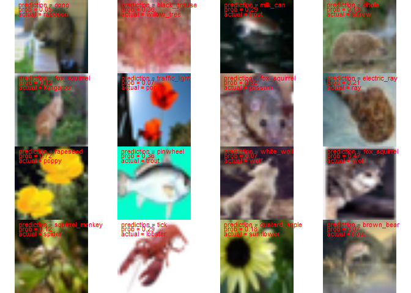
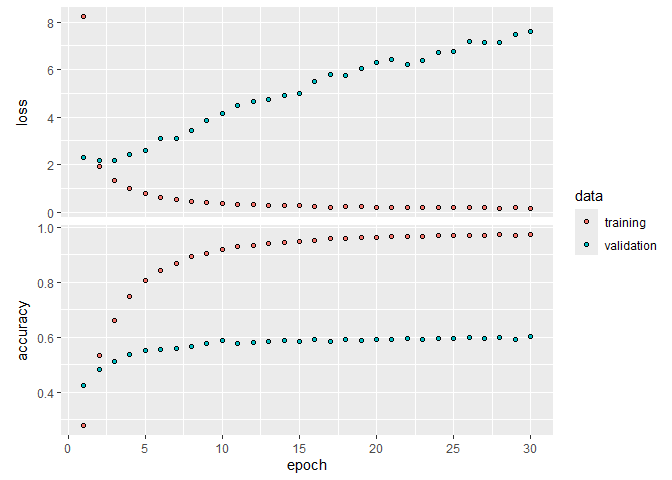
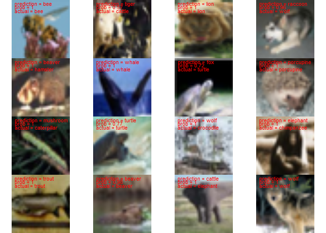

Transfer learning
================
Brett Melbourne
07 Mar 2024

To demonstrate transfer learning we’ll continue to use the ecological
subset of the CIFAR100 data and compare a transfer learning approach to
our previous model trained from scratch.

``` r
reticulate::use_condaenv(condaenv = "r-tensorflow")
library(ggplot2)
library(dplyr)
library(keras)
tensorflow::set_random_seed(2914) #sets for tensorflow, keras, and R
```

For transfer learning, we’ll use the VGG16 model, which is a
convolutional neural network trained on 1.2 million images from the
ImageNet benchmark image database. Load the VGG16 pretrained model and
examine its architecture. It is similar to the CNN model we fitted from
scratch but has two convolutional layers in a row in each convolution
block. The output is a prediction of 1000 categories.

``` r
vgg16 <- application_vgg16(weights="imagenet")
vgg16
```

    ## Model: "vgg16"
    ## ________________________________________________________________________________
    ##  Layer (type)                       Output Shape                    Param #     
    ## ================================================================================
    ##  input_1 (InputLayer)               [(None, 224, 224, 3)]           0           
    ##  block1_conv1 (Conv2D)              (None, 224, 224, 64)            1792        
    ##  block1_conv2 (Conv2D)              (None, 224, 224, 64)            36928       
    ##  block1_pool (MaxPooling2D)         (None, 112, 112, 64)            0           
    ##  block2_conv1 (Conv2D)              (None, 112, 112, 128)           73856       
    ##  block2_conv2 (Conv2D)              (None, 112, 112, 128)           147584      
    ##  block2_pool (MaxPooling2D)         (None, 56, 56, 128)             0           
    ##  block3_conv1 (Conv2D)              (None, 56, 56, 256)             295168      
    ##  block3_conv2 (Conv2D)              (None, 56, 56, 256)             590080      
    ##  block3_conv3 (Conv2D)              (None, 56, 56, 256)             590080      
    ##  block3_pool (MaxPooling2D)         (None, 28, 28, 256)             0           
    ##  block4_conv1 (Conv2D)              (None, 28, 28, 512)             1180160     
    ##  block4_conv2 (Conv2D)              (None, 28, 28, 512)             2359808     
    ##  block4_conv3 (Conv2D)              (None, 28, 28, 512)             2359808     
    ##  block4_pool (MaxPooling2D)         (None, 14, 14, 512)             0           
    ##  block5_conv1 (Conv2D)              (None, 14, 14, 512)             2359808     
    ##  block5_conv2 (Conv2D)              (None, 14, 14, 512)             2359808     
    ##  block5_conv3 (Conv2D)              (None, 14, 14, 512)             2359808     
    ##  block5_pool (MaxPooling2D)         (None, 7, 7, 512)               0           
    ##  flatten (Flatten)                  (None, 25088)                   0           
    ##  fc1 (Dense)                        (None, 4096)                    102764544   
    ##  fc2 (Dense)                        (None, 4096)                    16781312    
    ##  predictions (Dense)                (None, 1000)                    4097000     
    ## ================================================================================
    ## Total params: 138357544 (527.79 MB)
    ## Trainable params: 138357544 (527.79 MB)
    ## Non-trainable params: 0 (0.00 Byte)
    ## ________________________________________________________________________________

First, let’s try using VGG16 to predict the label for an image from
wikipedia (an elephant). Keras has a few helper functions to prepare the
image so that it’s suitable for input to the VGG16 model. It needs to be
the correct size and in an array with the correct dimensions. The format
of the ImageNet dataset has color channels in a different order (BGR
instead of RGB) and a different scaling for the channel levels, which we
change using a `preprocess` helper function provided in keras.

``` r
url <- "https://upload.wikimedia.org/wikipedia/commons/3/37/African_Bush_Elephant.jpg"
temp_path <- tempfile(fileext=".jpg")
download.file(url, temp_path, mode="wb")
img <- image_load(temp_path, target_size=c(224,224))
img <- image_to_array(img)
img_inet <- array_reshape(img, c(1, dim(img)))
img_inet <- imagenet_preprocess_input(img_inet)
```

This is the image

``` r
plot(as.raster(img / 255))
```

<!-- -->

Now feed the prepared image to the CNN for prediction. First we get a
column matrix of the scores (probabilities) for each of the 1000
categories.

``` r
pred <- predict(vgg16, img_inet)
```

    ## 1/1 - 0s - 389ms/epoch - 389ms/step

Now we can print the top 5 predictions (5 most probable) with a Keras
function that looks up the category names. The prediction is spot on.

``` r
imagenet_decode_predictions(pred, top=5)
```

    ## [[1]]
    ##   class_name class_description        score
    ## 1  n02504458  African_elephant 8.518142e-01
    ## 2  n01871265            tusker 1.398824e-01
    ## 3  n02504013   Indian_elephant 8.228640e-03
    ## 4  n01704323       triceratops 6.965498e-05
    ## 5  n02397096           warthog 1.866233e-06

Now let’s consider our CIFAR56eco dataset with this VGG16 pretrained
model. In the previous script we prepared the dataset.

``` r
load("data_large/cifar56eco.RData")
```

Out of curiosity, let’s plot a random selection of predictions using the
pretrained model to see what it would predict out of the box for our
CIFAR56eco images. To feed our 32 x 32 images to VGG16, we need to match
the input image size (VGG16 needs 224 x 224).

``` r
selection <- sort(sample(1:dim(x_test)[1], 16))
par(mar=c(0,0,0,0), mfrow=c(4,4))
for ( i in selection ) {
    img <- image_array_resize( x_test[i,,,,drop=FALSE], 224, 224)
    img_inet <- imagenet_preprocess_input(img)
    pred <- predict(vgg16, img_inet)
    pred_lab <- imagenet_decode_predictions(pred, top=1)[[1]]$class_description
    plot(as.raster(x_test[i,,,] / 255))
    text(0, 30, paste("prediction =", pred_lab), col="red", pos=4)
    text(0, 28, paste("prob =", round(pred[which.max(pred)],2)), col="red", pos=4)
    text(0, 26, paste("actual =", eco_labels$name[y_test[i,]+1]), col="red", pos=4)
} 
```

    ## 1/1 - 0s - 187ms/epoch - 187ms/step

    ## 1/1 - 0s - 190ms/epoch - 190ms/step

    ## 1/1 - 0s - 189ms/epoch - 189ms/step

    ## 1/1 - 0s - 201ms/epoch - 201ms/step

    ## 1/1 - 0s - 187ms/epoch - 187ms/step

    ## 1/1 - 0s - 189ms/epoch - 189ms/step

    ## 1/1 - 0s - 188ms/epoch - 188ms/step

    ## 1/1 - 0s - 194ms/epoch - 194ms/step

    ## 1/1 - 0s - 185ms/epoch - 185ms/step

    ## 1/1 - 0s - 191ms/epoch - 191ms/step

    ## 1/1 - 0s - 197ms/epoch - 197ms/step

    ## 1/1 - 0s - 219ms/epoch - 219ms/step

    ## 1/1 - 0s - 190ms/epoch - 190ms/step

    ## 1/1 - 0s - 188ms/epoch - 188ms/step

    ## 1/1 - 0s - 193ms/epoch - 193ms/step

    ## 1/1 - 0s - 186ms/epoch - 186ms/step

<!-- -->

The 1000 VGG16 categories are quite different to the 56 categories we
want to predict in the CIFAR56eco data so we’re not going to expect good
predictions unless there is a large degree of overlap in the categories.
Nevertheless, we see that a few images are correctly classified, some
others are close, and we can understand why some of the other
predictions are as they are.

## Transfer learning set up and training

Set up a model to predict our 56 ecological categories by disconnecting
the convolutional base from the pretrained VGG16 model. In keras we can
do this by specifying `include_top=FALSE`.

``` r
vgg16_base <- application_vgg16(weights="imagenet", include_top=FALSE, 
                                input_shape=c(224, 224, 3))
```

We can think of this pretrained convolutional base as a skilled feature
extraction tool. It takes a 224 x 224 image and extracts features. The
final output is a 7 x 7 x 512 array, which equals 25088 features.

``` r
vgg16_base
```

    ## Model: "vgg16"
    ## ________________________________________________________________________________
    ##  Layer (type)                       Output Shape                    Param #     
    ## ================================================================================
    ##  input_2 (InputLayer)               [(None, 224, 224, 3)]           0           
    ##  block1_conv1 (Conv2D)              (None, 224, 224, 64)            1792        
    ##  block1_conv2 (Conv2D)              (None, 224, 224, 64)            36928       
    ##  block1_pool (MaxPooling2D)         (None, 112, 112, 64)            0           
    ##  block2_conv1 (Conv2D)              (None, 112, 112, 128)           73856       
    ##  block2_conv2 (Conv2D)              (None, 112, 112, 128)           147584      
    ##  block2_pool (MaxPooling2D)         (None, 56, 56, 128)             0           
    ##  block3_conv1 (Conv2D)              (None, 56, 56, 256)             295168      
    ##  block3_conv2 (Conv2D)              (None, 56, 56, 256)             590080      
    ##  block3_conv3 (Conv2D)              (None, 56, 56, 256)             590080      
    ##  block3_pool (MaxPooling2D)         (None, 28, 28, 256)             0           
    ##  block4_conv1 (Conv2D)              (None, 28, 28, 512)             1180160     
    ##  block4_conv2 (Conv2D)              (None, 28, 28, 512)             2359808     
    ##  block4_conv3 (Conv2D)              (None, 28, 28, 512)             2359808     
    ##  block4_pool (MaxPooling2D)         (None, 14, 14, 512)             0           
    ##  block5_conv1 (Conv2D)              (None, 14, 14, 512)             2359808     
    ##  block5_conv2 (Conv2D)              (None, 14, 14, 512)             2359808     
    ##  block5_conv3 (Conv2D)              (None, 14, 14, 512)             2359808     
    ##  block5_pool (MaxPooling2D)         (None, 7, 7, 512)               0           
    ## ================================================================================
    ## Total params: 14714688 (56.13 MB)
    ## Trainable params: 14714688 (56.13 MB)
    ## Non-trainable params: 0 (0.00 Byte)
    ## ________________________________________________________________________________

We then freeze the weights so these won’t be trained further, and add a
single-layer feedforward network for our 56 ecological categories (the
same architecture we used in our model trained from scratch). Instead of
resizing all the images in our image array, which would use a lot of
memory, we have specified the input image size to be the same as the
original images but have included a resizing layer in the network.

``` r
freeze_weights(vgg16_base)
modtfr1 <- keras_model_sequential(input_shape=c(32, 32, 3)) |>
    layer_resizing(224, 224) |>
    vgg16_base() |>
#   Flatten with dropout regularization
    layer_flatten() |>
    layer_dropout(rate=0.5) |>
#   Standard dense layer
    layer_dense(units=512) |>
    layer_activation_relu() |>
#   Output layer with softmax (56 categories to predict)    
    layer_dense(units=56) |> 
    layer_activation_softmax()

modtfr1 # Check the architecture
```

    ## Model: "sequential"
    ## ________________________________________________________________________________
    ##  Layer (type)                  Output Shape               Param #    Trainable  
    ## ================================================================================
    ##  resizing (Resizing)           (None, 224, 224, 3)        0          Y          
    ##  vgg16 (Functional)            (None, 7, 7, 512)          14714688   N          
    ##  flatten (Flatten)             (None, 25088)              0          Y          
    ##  dropout (Dropout)             (None, 25088)              0          Y          
    ##  dense_1 (Dense)               (None, 512)                12845568   Y          
    ##  re_lu (ReLU)                  (None, 512)                0          Y          
    ##  dense (Dense)                 (None, 56)                 28728      Y          
    ##  softmax (Softmax)             (None, 56)                 0          Y          
    ## ================================================================================
    ## Total params: 27588984 (105.24 MB)
    ## Trainable params: 12874296 (49.11 MB)
    ## Non-trainable params: 14714688 (56.13 MB)
    ## ________________________________________________________________________________

This model has 27.6 million parameters with 12.9 million parameters to
be trained.

Prepare the data for training with the VGG16 model

``` r
x_train_inet <- imagenet_preprocess_input(x_train)
x_test_inet <- imagenet_preprocess_input(x_test)
y_train <- to_categorical(y_train, 56)
```

Compile and train as we previously did with our model trained from
scratch. I trained this on 3 NVIDIA A100 GPUs, which took about 5 mins.
Don’t try this on CPU!

``` r
compile(modtfr1, loss="categorical_crossentropy", optimizer="rmsprop",
        metrics="accuracy")
fit(modtfr1, x_train_inet, y_train, epochs=30, batch_size=128, 
    validation_split=0.2) -> history
```

Save the model (or load previously trained model). This model is too big
to save on GitHub. You can download the trained model from
[here](https://o365coloradoedu-my.sharepoint.com/:u:/g/personal/melbourn_colorado_edu/EQ-ZYbGLhnJJjD8_OFDU-bkBCKH9h_srfpfW-24fkVHZXw?e=3AsHQ3).
Save the unzipped model directory into the location below. The history
file is available from GitHub.

``` r
# save_model_tf(modtfr1, "08_6_transfer_learning_files/saved/modtfr1")
# save(history, file="08_6_transfer_learning_files/saved/modtfr1_history.Rdata")
modtfr1 <- load_model_tf("08_6_transfer_learning_files/saved/modtfr1")
load("08_6_transfer_learning_files/saved/modtfr1_history.Rdata")
```

Plot the training history. Again, we see evidence of overfitting after a
few epochs as the validation loss climbs. Nevertheless, the training
accuracy continues to improve but is mostly done after about 15 epochs,
climbing to about 60%.

``` r
plot(history, smooth=FALSE)
```

<!-- -->

Why do the validation loss and accuracy loss give different signals? The
validation loss is accounting for accuracy in the predicted probability
across all of the categories, whereas the accuracy loss is only
assessing the single predicted category. This pattern suggests we have
more parameters in the model than we need for accurate prediction, so
this model is not efficient.

For the out-of-sample prediction accuracy we’ll check predictions
against the hold-out test set. Prediction is also best done on GPU. This
will take about 15 mins on CPU but seconds on GPU.

``` r
pred_prob <- predict(modtfr1, x_test_inet)
```

We’ll save this output since it is intensive to compute

``` r
# save(pred_prob, file="08_6_transfer_learning_files/saved/modtfr1_pred_prob.Rdata")
load(file="08_6_transfer_learning_files/saved/modtfr1_pred_prob.Rdata")
```

Accuracy on our hold-out test set is 60% (matching the validation
accuracy), improving from 42% in our model trained from scratch. We got
a considerable improvement from transfer learning!

``` r
pred_cat <- as.numeric(k_argmax(pred_prob))
mean(pred_cat == drop(y_test))
```

    ## [1] 0.6032143

Plot a random selection of predictions from the test set

``` r
selection <- sort(sample(1:dim(x_test)[1], 16))
par(mar=c(0,0,0,0), mfrow=c(4,4))
for ( i in selection ) {
    pred <- as.numeric(predict(modtfr1, x_test_inet[i,,,,drop=FALSE]))
    plot(as.raster(x_test[i,,,] / 255))
    text(0, 30, paste("prediction =", eco_labels$name[which.max(pred)]), col="red", pos=4)
    text(0, 28, paste("prob =", round(pred[which.max(pred)],2)), col="red", pos=4)
    text(0, 26, paste("actual =", eco_labels$name[y_test[i,]+1]), col="red", pos=4)
} 
```

    ## 1/1 - 0s - 319ms/epoch - 319ms/step

    ## 1/1 - 0s - 179ms/epoch - 179ms/step

    ## 1/1 - 0s - 198ms/epoch - 198ms/step

    ## 1/1 - 0s - 191ms/epoch - 191ms/step

    ## 1/1 - 0s - 190ms/epoch - 190ms/step

    ## 1/1 - 0s - 187ms/epoch - 187ms/step

    ## 1/1 - 0s - 186ms/epoch - 186ms/step

    ## 1/1 - 0s - 187ms/epoch - 187ms/step

    ## 1/1 - 0s - 196ms/epoch - 196ms/step

    ## 1/1 - 0s - 189ms/epoch - 189ms/step

    ## 1/1 - 0s - 187ms/epoch - 187ms/step

    ## 1/1 - 0s - 188ms/epoch - 188ms/step

    ## 1/1 - 0s - 201ms/epoch - 201ms/step

    ## 1/1 - 0s - 191ms/epoch - 191ms/step

    ## 1/1 - 0s - 195ms/epoch - 195ms/step

    ## 1/1 - 0s - 186ms/epoch - 186ms/step

<!-- -->

It’s impressive that we can predict the category for many of these low
quality images. There are also some notable misses, such as the elephant
predicted to be “cattle”.

This model is a first pass. It surely has too many parameters and is not
efficient. Things to try next would be to reduce the size of the hidden
layer in the feedforward network, or eliminate it altogether. It’s also
not clear how much of the improved predictive performance is due to
transfer learning versus the different VGG16 architecture. We could also
try fitting the VGG16 convolutional layers from scratch but the
advantage of transfer learning is that we don’t have to do that. As
another thing to try, we could unfreeze some of the convolution blocks
(typically the later ones) and fine tune those.

Finally, the training approach here applies generally to more complex
variations of this model (e.g. we could include further regularization
strategies such as data augmentation) but it is not the most efficient
way to train this uncomplicated model. A more efficient approach would
break the training into two phases: 1) use `vgg16_base` to extract and
save the features from the training set, 2) train the feedforward
network, where the inputs are the extracted features. This training
approach is very fast in comparison and is feasible on CPU.
